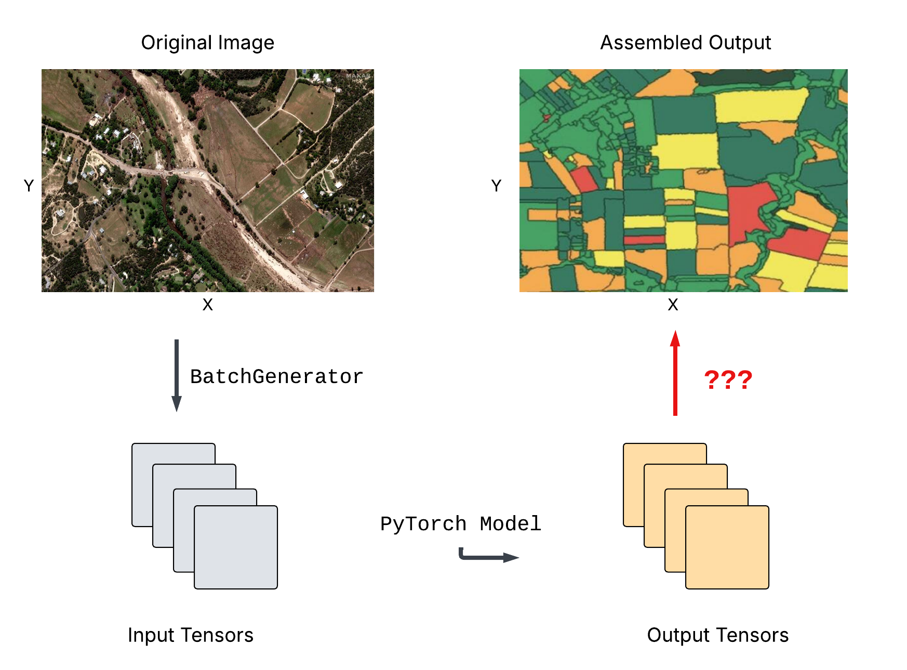

# Xarray for Deep Learning Cookbook



[](https://github.com/ProjectPythia/cookbook-template/actions/workflows/nightly-build.yaml)
[](https://binder.projectpythia.org/v2/gh/ProjectPythia/cookbook-template/main?labpath=notebooks)
[](https://zenodo.org/badge/latestdoi/475509405)

This Project Pythia Cookbook covers a workflow for using Xarray and xbatcher for deep learning applications. Specifically, it demonstrates a reusable workflow for recreating an xarray dataset from a deep learning model's output, which can be used for further analysis or visualization.

## Motivation

This cookbook will be useful for data scientists and machine learning practitioners who want to leverage the power of `xarray` and `xbatcher` for their deep learning workflows. By the end of this cookbook, you will have gained skills in loading and processing Xarray datasets into a format suitable for deep learning using `xbatcher` and furthermore, you will learn how to recreate an Xarray dataset from the output of a deep learning model.

## Authors

[Keenan Ganz](https://github.com/s-kganz), [Nabin Kalauni](https://github.com/nkalauni)

### Contributors

<a href="https://github.com/ProjectPythia/xbatcher-deep-learning/graphs/contributors">
  
</a>

## Structure

This cookbook is broken up into two main sections - "xbatcher Fundamentals" and "Example Workflow". The first section covers the foundational concepts and tools needed to work with `xbatcher` and `xarray`, while the second section provides a practical example of how to use these tools in a complete end-to-end workflow.

### xbatcher Fundamentals

The foundational content includes an overview of `xbatcher`, its key features, and how it integrates with `xarray` for efficient data handling in deep learning workflows. The first chapter covers using xbatcher to create batches of data from an `xarray` dataset whereas the second chapter focuses on recreating an `xarray` dataset from the output of a deep learning model.

### Example Workflow

Example workflow includes using `xbatcher` to create batches of data from an `xarray` dataset (ASTER Global Digital Elevation model), training an Autoencoder on this data, and then using `xbatcher` again to reassemble the model's output into a new `xarray` dataset.

## Running the Notebooks

You can either run the notebook using [Binder](https://binder.projectpythia.org/) or on your local machine.

### Running on Binder

The simplest way to interact with a Jupyter Notebook is through
[Binder](https://binder.projectpythia.org/), which enables the execution of a
[Jupyter Book](https://jupyterbook.org) in the cloud. The details of how this works are not
important for now. All you need to know is how to launch a Pythia
Cookbooks chapter via Binder. Simply navigate your mouse to
the top right corner of the book chapter you are viewing and click
on the rocket ship icon, (see figure below), and be sure to select
“launch Binder”. After a moment you should be presented with a
notebook that you can interact with. I.e. you’ll be able to execute
and even change the example programs. You’ll see that the code cells
have no output at first, until you execute them by pressing
<kbd>Shift</kbd>+<kbd>Enter</kbd>. Complete details on how to interact with
a live Jupyter notebook are described in [Getting Started with
Jupyter](https://foundations.projectpythia.org/foundations/getting-started-jupyter).

Note, not all Cookbook chapters are executable. If you do not see
the rocket ship icon, such as on this page, you are not viewing an
executable book chapter.


### Running on Your Own Machine

If you are interested in running this material locally on your computer, you will need to follow this workflow:

1. Clone the `https://github.com/ProjectPythia/xbatcher-deep-learning` repository:

   ```bash
    git clone https://github.com/ProjectPythia/xbatcher-deep-learning.git
   ```

1. Move into the `xbatcher-deep-learning` directory
   ```bash
   cd xbatcher-deep-learning
   ```
1. Create and activate your conda environment from the `environment.yml` file
   ```bash
   conda env create -f environment.yml
   conda activate cookbook-dev
   ```
1. Move into the `notebooks` directory and start up Jupyterlab
   ```bash
   cd notebooks/
   jupyter lab
   ```
